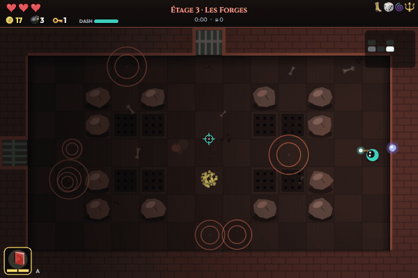
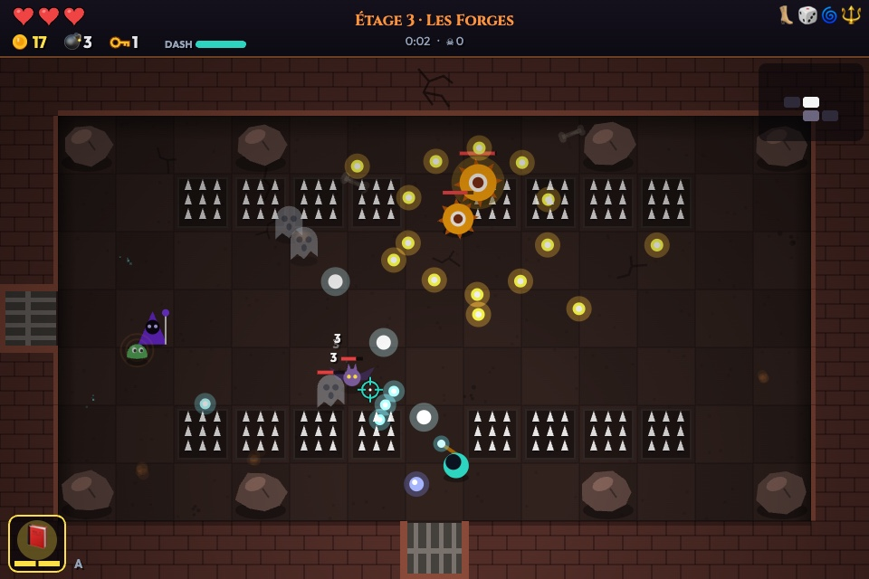
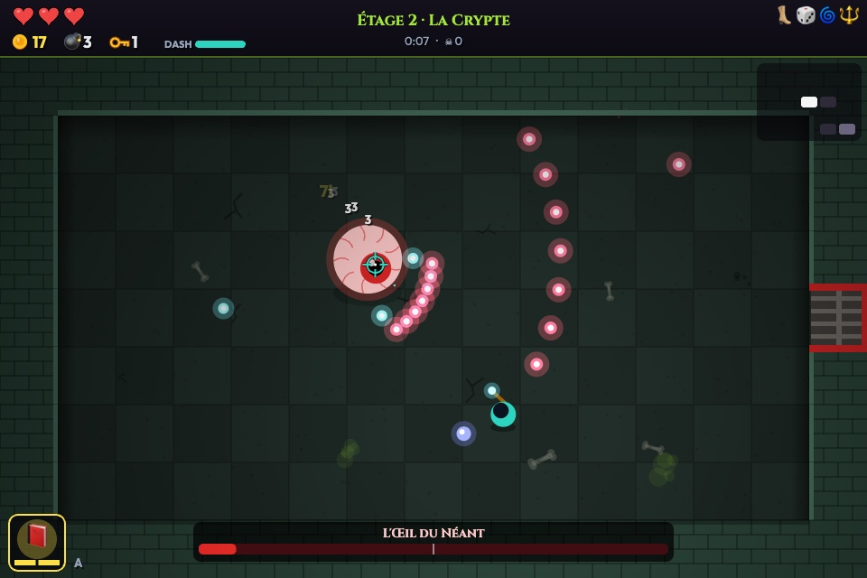
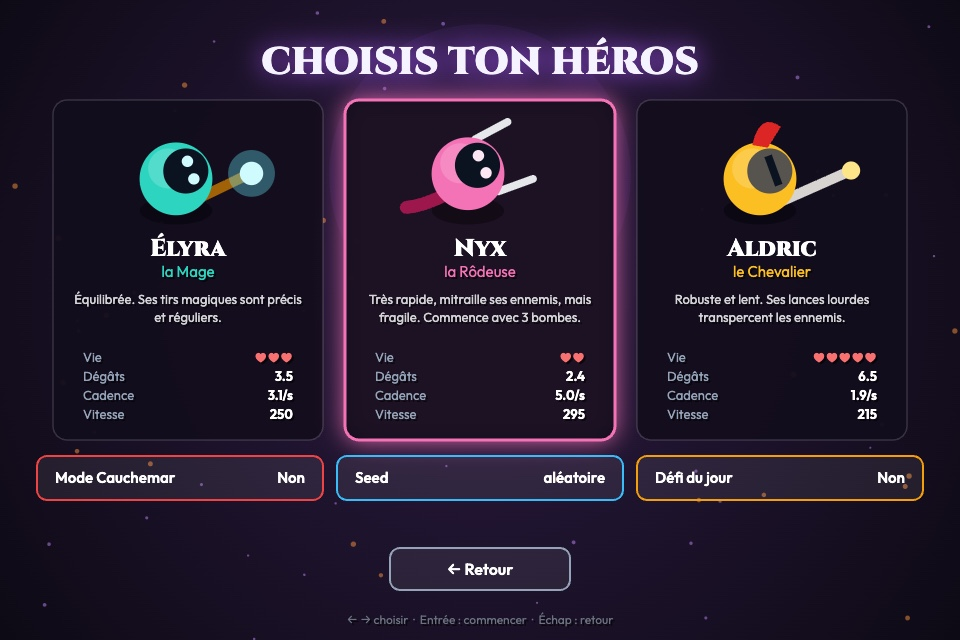
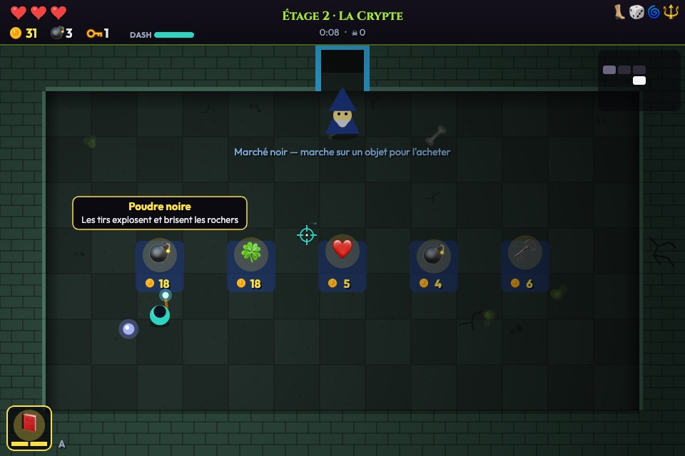
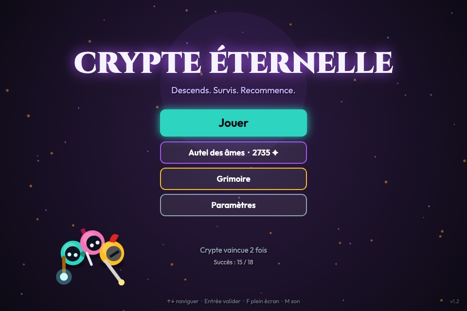
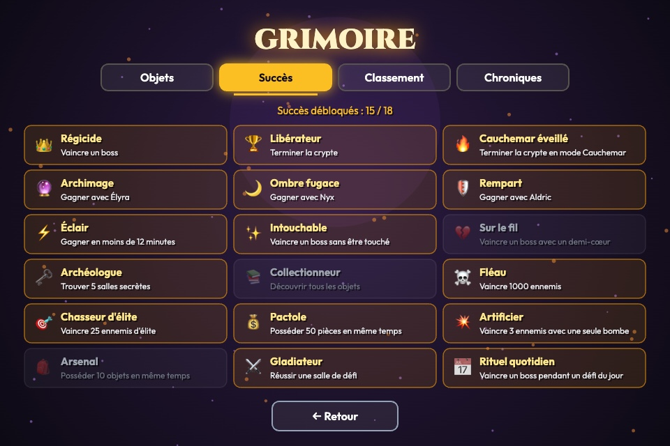

<div align="center">

# Crypte Éternelle

**Roguelike d'action en 2D, jouable directement dans le navigateur.**

Descends dans une crypte générée aléatoirement, affronte ses gardiens, combine des objets… et recommence.

[](https://github.com/sdelmart/crypte-eternelle/actions/workflows/ci.yml)
[](LICENSE)


### [▶ Jouer maintenant](https://sdelmart.github.io/crypte-eternelle/)



</div>

## Aperçu

|                      Combat                      |                      Boss                      |
| :----------------------------------------------: | :--------------------------------------------: |
|        |  |
|                **Choix du héros**                |                **Marché noir**                 |
|  |                      |
|                **Menu principal**                |             **Grimoire et succès**             |
|                  |                  |

## Fonctionnalités

- **5 étages générés procéduralement** : salles de trésor, boutiques, salles de défi à vagues et salles secrètes à faire exploser
- **3 héros** au style de jeu distinct, dont deux à débloquer
- **4 boss** avec plusieurs attaques et une seconde phase, et **9 types d'ennemis** (plus des variantes d'élite)
- **26 objets** passifs et actifs qui se combinent : tirs explosifs, à tête chercheuse, perçants, orbes gardiens…
- **Clés, coffres, bombes** et pièges à pointes
- **Seeds partageables** et **défi du jour** : un même code donne exactement le même donjon
- **Mode Cauchemar**, **18 succès**, classement local et progression permanente (Autel des âmes)
- **Musique et sons générés en temps réel**, sans aucun fichier audio
- Jouable au **clavier et souris**, à la **manette** et sur **écran tactile**

## Commandes

| Action            | Clavier / souris  | Manette      | Tactile         |
| ----------------- | ----------------- | ------------ | --------------- |
| Se déplacer       | ZQSD / WASD       | Stick gauche | Joystick gauche |
| Viser et tirer    | Souris ou flèches | Stick droit  | Joystick droit  |
| Dash (invincible) | Espace            | A / RB       | Bouton 💨       |
| Bombe             | E                 | X / LB       | Bouton 💣       |
| Objet actif       | A (Q en QWERTY)   | Y            | Bouton ✦        |
| Carte             | Tab               | Select       | Haut de l'écran |
| Pause             | Échap / P         | Start        | Bouton ⏸        |

Toutes les touches du clavier se reconfigurent dans les paramètres.

## Accessibilité

- Touches reconfigurables, avec les noms adaptés à la disposition du clavier (AZERTY / QWERTY)
- Option « Réduire les flashs » et désactivation des tremblements d'écran
- Mode « tirs ennemis contrastés » pour mieux distinguer les projectiles
- Tutoriel interactif adapté à l'appareil utilisé, rejouable à tout moment
- Navigation complète des menus au clavier et à la manette

## Points techniques

- **Zéro dépendance à l'exécution** : JavaScript natif, rendu Canvas 2D et Web Audio API. Vite ne sert qu'au développement et au build.
- **Génération procédurale** : étages construits par marche aléatoire sur une grille, avec placement des salles spéciales selon la distance au départ. Les tests vérifient sur 600 étages que chaque salle est accessible et que les portes sont cohérentes.
- **Reproductibilité** : un générateur pseudo-aléatoire à seed (mulberry32 et hachage FNV-1a) pilote la structure des étages et le contenu de chaque salle, tiré à l'avance.
- **Déplacement des ennemis** : champ de distances (BFS) recalculé autour du joueur, combiné à un test de ligne de vue pour un mouvement direct quand c'est possible.
- **Collisions** cercle contre tuiles, avec sous-pas pour éviter de traverser les murs à grande vitesse.
- **Musique procédurale** : séquenceur à ordonnancement anticipé, progressions d'accords et mélodies générées par seed, une piste par étage et une pour les boss.
- **Rendu** : salles pré-rendues dans des canvas hors écran à la résolution de l'écran, éclairage dynamique autour du joueur, particules et arrêts sur image.
- **Rendu net à toutes les tailles** : la logique tourne en 960×640, le rendu s'adapte à la taille et à la densité de l'écran.

## Développement

Prérequis : Node.js 22.12 ou plus récent.

```bash
npm install
npm run dev       # serveur de développement
npm test          # tests (Vitest)
npm run lint      # ESLint
npm run build     # build de production dans dist/
```

Chaque envoi sur `main` lance l'intégration continue (lint, formatage, tests, build), puis déploie automatiquement le jeu sur GitHub Pages.

### Tests

La suite Vitest couvre :

- la génération des étages (structure, accessibilité, portes, reproductibilité par seed) ;
- les utilitaires (aléatoire, collisions, seeds) ;
- les données (objets, héros, succès) ;
- le score, le classement et la migration des sauvegardes ;
- des **parties complètes jouées automatiquement sans affichage**, pour chaque héros, du premier étage jusqu'à la victoire.

### Structure

```
src/
├── core/      utilitaires, paramètres, audio, entrées (clavier, souris, manette, tactile)
├── data/      objets, héros, améliorations, succès
├── world/     génération des étages, joueur, ennemis et IA des boss
├── render/    dessin des personnages et primitives graphiques
├── game/      logique de partie (game.js) et interface (draw.js)
└── main.js    boucle principale et chargement
tests/         tests Vitest
docs/          captures d'écran du README
```

## Licence

Code sous licence [MIT](LICENSE). Polices Cinzel et Outfit sous licence SIL Open Font License.
